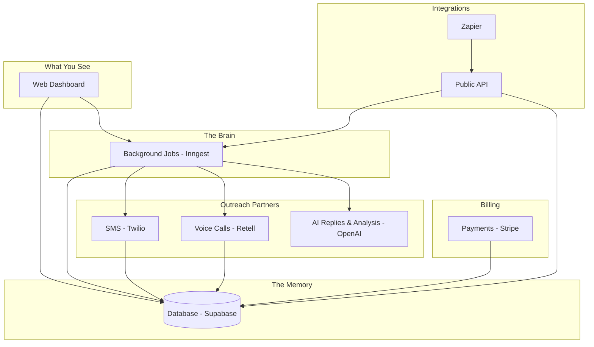
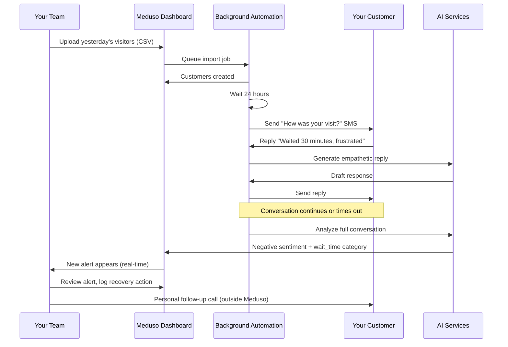

# Meduso AI — Client Handoff Guide

**Who this document is for:** Business owners, operators, and non-technical stakeholders who will use or own Meduso AI.

**What this document is not:** A developer manual. For API keys, deployment steps, and technical setup, see [CREDENTIALS.md](./CREDENTIALS.md) and [README.md](./README.md).

---

## 1. What Meduso AI Does (In One Paragraph)

Meduso AI helps local businesses **catch unhappy customers early** — before they leave a bad review or stop coming back.

After a customer visits your business, Meduso can automatically reach out by **text message** (and optionally **phone call**) to ask how their experience was. If the feedback is negative or needs attention, Meduso creates an **alert** on your dashboard so your team can follow up and recover the relationship.

Think of it as a polite, automated check-in system with a smart inbox for problems that need a human touch.

---

## 2. The Customer Journey (What Your Team Experiences)

### Step 1 — Sign up and set up your business

1. Someone creates an account (email/password or Google sign-in).
2. They complete a short **onboarding** form: business name, timezone, etc.
3. Meduso creates your organization, subscription (starts on Free), and default outreach settings.

### Step 2 — Add customers

You can bring customers into Meduso four ways:

| Method | Where in the app | Best for |
|--------|------------------|----------|
| **Manual entry** | Customers → Add customer | One-off additions |
| **CSV upload** | Customers → Import | Bulk upload from a spreadsheet |
| **API** | Settings → API keys | Your CRM or custom software |
| **Zapier** | External Zapier app | Connecting tools like Square, HubSpot, etc. |

Each customer needs at least a **name** and **phone number**. Email, visit date, and location are optional but helpful.

### Step 3 — Automatic outreach (usually SMS)

When a new customer is added, Meduso waits a configurable period (default: **24 hours** after their visit), then sends a friendly text like:

> *"Hi Sarah, thanks for visiting Downtown Coffee! How was your experience?"*

This happens automatically in the background — no one on your team has to press "send."

### Step 4 — Two-way conversation

If the customer replies by text:

- Meduso reads their message.
- An AI assistant drafts a natural, on-brand reply (using your business name).
- The conversation continues for a limited number of back-and-forth messages (default: **6** from your side).
- If the customer texts **STOP**, **UNSUBSCRIBE**, or similar, they are opted out and the conversation ends respectfully.

If they don't reply within **2 hours**, the conversation is marked complete automatically.

### Step 5 — Analysis and alerts

When a conversation ends (customer stopped replying, max messages reached, opt-out, or voice call finished):

- Meduso **analyzes** the full conversation.
- It looks for negative sentiment, specific complaint categories (wait time, staff attitude, billing, etc.), and recovery opportunities.
- If something needs attention, an **alert** appears in your **Alerts** inbox — often in real time.

### Step 6 — Your team takes action

On the **Dashboard** and **Alerts** pages, your team sees:

- How many conversations happened
- How many alerts need review
- Recovery opportunities

From a conversation's detail page, staff can log **recovery actions** (e.g., "called customer," "offered discount") to track what was done.

### Step 7 — Optional voice calls

For individual customers, you can trigger a **voice call** from their profile. Meduso uses an AI phone agent (via Retell) to conduct a short feedback call. The transcript is saved and analyzed the same way as SMS.

### Step 8 — Billing and limits

Each plan includes monthly limits on SMS, voice minutes, and customer imports. Usage is shown on **Settings → Billing**. When limits are reached or payment fails, outreach pauses until you upgrade or fix billing.

---

## 3. The Big Picture — How the Pieces Connect

Meduso is not one single app. It is several services working together, like departments in a company:

**In plain English:**

| Service | Role | Analogy |
|---------|------|---------|
| **Web Dashboard** | The website your team logs into | The front desk |
| **Supabase (Database)** | Stores customers, conversations, alerts, billing | The filing cabinet |
| **Inngest** | Runs scheduled and background tasks | The operations manager who never sleeps |
| **Twilio** | Sends and receives text messages | The post office for SMS |
| **OpenAI** | Writes replies and analyzes conversations | The assistant who reads and summarizes |
| **Retell** | Places AI phone calls | The phone operator |
| **Stripe** | Handles subscriptions and payments | The billing department |
| **Zapier** | Connects Meduso to 6,000+ other apps | The universal adapter |
| **Sentry** | Catches software errors in production | The smoke alarm for the engineering team |
| **Vercel** | Hosts the live website on the internet | The building where the front desk lives |

---

## 4. Project Folder Guide (What Lives Where)

The entire product lives in one repository (codebase) with four main areas. You do not need to open these folders — this section explains what each area is responsible for.

### `docs/` — Project documentation

| File | What it is |
|------|------------|
| **CLIENT_HANDOFF.md** | This document — business overview for non-technical owners |
| **EXECUTIVE_SUMMARY.md** | One-page executive overview |
| **CREDENTIALS.md** | Checklist of every password and API key your technical team needs |
| **README.md** | Technical getting-started guide for developers |
| **MVP_ARCHITECTURE_PLAN.md** | Original MVP technical blueprint and build roadmap |

### Root level (top of the project)

| File / folder | What it is |
|---------------|------------|
| **README.md** | Short entry point with links to all documentation |
| **.env.example** | Template listing secret settings (never put real passwords here) |
| **package.json** | Master list of project dependencies and run commands |

---

### `apps/web/` — The website your team uses

This is the **dashboard** — everything you see in the browser.

#### Main screens (pages)

| Screen | URL path | What you do here |
|--------|----------|------------------|
| Login / Register | `/login`, `/register` | Sign in or create an account |
| Forgot password | `/forgot-password` | Reset a lost password |
| Onboarding | `/onboarding` | First-time business setup |
| Dashboard | `/dashboard` | Overview: KPIs, alerts needing action, usage warnings |
| Customers list | `/customers` | See all customers, import CSV, add new |
| Customer detail | `/customers/[id]` | View one customer, edit, trigger voice call |
| Conversations list | `/conversations` | All SMS and voice conversations |
| Conversation detail | `/conversations/[id]` | Full message history, transcript, recovery panel |
| Alerts inbox | `/alerts` | Negative feedback and recovery opportunities (live updates) |
| Analytics | `/analytics` | Trends by complaint category over time |
| Billing | `/settings/billing` | Current plan, usage meters, upgrade |
| API keys | `/settings/api-keys` | Create keys for Zapier and integrations |

#### Important behind-the-scenes parts of the website

| Area | Plain-English purpose |
|------|----------------------|
| `src/inngest/functions/` | **Automation recipes** — the step-by-step instructions for scheduling outreach, sending SMS, analyzing conversations, creating alerts, parsing CSV imports, placing voice calls, and notifying Zapier |
| `src/app/api/` | **Internal API endpoints** — checkout, billing portal, voice call triggers, and the connection point for background jobs |
| `src/lib/` | **Helper logic** — fetching customers, checking billing limits, formatting phone numbers, talking to the database |
| `src/components/` | **Visual building blocks** — buttons, tables, forms, banners, and page layouts |
| `src/hooks/` | **Live updates** — keeps the Alerts page refreshing when new alerts arrive |
| `middleware.ts` | **Security gate** — redirects logged-out users to login and new users to onboarding |

#### The automation recipes (Inngest functions) explained

These run automatically without anyone clicking a button:

| Recipe name | What it does |
|-------------|--------------|
| `schedule-outreach` | When a customer is added, waits the configured delay, then queues the first text |
| `send-initial-sms` | Sends the opening text message and starts the conversation |
| `check-conversation-timeout` | Ends conversations where the customer never replied in time |
| `end-conversation-on-max-turns` | Ends conversations that hit the message limit |
| `parse-customer-import` | Reads an uploaded CSV row by row and creates customers |
| `analyze-conversation` | Reads a finished conversation and scores sentiment + categories |
| `create-alerts` | Turns analysis results into actionable alerts on your dashboard |
| `initiate-retell-call` | Places an AI voice call to a specific customer |
| `zapier-dispatch` | Tells Zapier when an alert is created or a conversation ends |

---

### `packages/shared/` — Shared rules used everywhere

This folder holds **one copy of the rules** so the website, background jobs, and server APIs all agree on the same definitions.

| Area | What it defines |
|------|-----------------|
| `billing/plans.ts` | Plan names, monthly SMS/voice/import limits (Free, Starter, Growth, Enterprise) |
| `enums.ts` | Standard labels: conversation status, alert severity, customer source, etc. |
| `categories/` | List of complaint categories (wait time, cleanliness, staff, etc.) |
| `twilio/` | How text messages are sent and how templates work (`{{name}}`, `{{businessName}}`) |
| `openai/` | How AI replies and conversation analysis work |
| `retell/` | How voice calls are placed |
| `alerts/` | Rules for when an alert should be created from analysis |
| `api-keys/` | How API keys are generated and verified |
| `dto/` | Validation rules for data coming in (customer name required, phone format, etc.) |
| `database/types.ts` | Descriptions of every data table's shape |

---

### `supabase/` — Database and server-side APIs

Supabase is your **data backbone** plus small **server programs** that run in the cloud.

#### Database migrations (`supabase/migrations/`)

These files built the database structure over time. Think of them as **blueprints** that created tables:

| Migration | What it created |
|-----------|-----------------|
| `initial_schema` | Core tables: organizations, customers, conversations, messages, alerts, subscriptions, usage counters |
| `rls_policies` | Privacy rules — each business only sees its own data |
| `onboarding_rpc` | One-click setup when a new business signs up |
| `storage_imports_bucket` | File storage for CSV uploads |
| `analytics_overview_rpc` | Dashboard numbers (conversation count, alert count, etc.) |
| `analytics_categories_rpc` | Category trend charts |
| `rate_limits_and_zapier` | Abuse protection + Zapier webhook subscriptions table |
| `billing_usage` | Usage tracking and plan limit enforcement |
| `billing_review_fixes` | Improved billing reliability (check before charge, webhook retries) |

#### Edge Functions (`supabase/functions/`)

These are **small server programs** that respond to outside events. They do not have a visual interface.

| Function | Triggered by | What it does |
|----------|--------------|--------------|
| `onboarding` | New user completes setup form | Creates organization, profile, subscription, and default settings in one transaction |
| `customers` | External API call with API key | Creates a customer (used by Zapier and CRM integrations) |
| `import` | CSV file upload from dashboard | Accepts the file and kicks off background parsing |
| `webhooks-twilio` | Twilio when a customer texts back | Receives inbound SMS, saves message, generates AI reply, sends reply |
| `webhooks-retell` | Retell when a voice call ends | Saves transcript and marks conversation complete |
| `webhooks-stripe` | Stripe when payment events happen | Updates subscription plan and status |
| `zapier-alerts` | Zapier polling | Returns new alerts for Zapier triggers |
| `zapier-conversations` | Zapier polling | Returns completed conversations for Zapier triggers |
| `zapier-hooks` | Zapier subscribe/unsubscribe | Registers webhook URLs for real-time Zapier triggers |
| `outreach-voice` | Zapier or API | Queues a voice call for a customer |

#### Shared helpers (`supabase/functions/_shared/`)

Reusable code snippets the Edge Functions share — authentication, rate limiting, sending texts, calling Inngest, tracking usage, etc.

---

### `integrations/zapier/` — The Zapier app

This is a **separate mini-app** published to Zapier's marketplace so your customers can connect Meduso to other tools without code.

| Piece | What it does |
|-------|--------------|
| `triggers/new_alert.js` | "When Meduso creates an alert, do something in another app" |
| `triggers/conversation_completed.js` | "When a conversation ends, do something in another app" |
| `creates/create_customer.js` | "When something happens in another app, add a customer to Meduso" |
| `creates/trigger_voice_call.js` | "When something happens in another app, call a customer" |
| `authentication.js` | How users connect with their Meduso API key |

---

## 5. Where Your Data Lives

Everything important is stored in a **PostgreSQL database** (hosted by Supabase). Each business (organization) has its own isolated data.

| Data type | What it stores | Example |
|-----------|----------------|---------|
| **Organization** | Your business name, timezone | "Downtown Coffee" |
| **Profile** | Team member name, role (Owner/Admin/Member) | "Jane, Owner" |
| **Customer** | Name, phone, email, visit date, source | "John Smith, +1-555-123-4567, CSV import" |
| **Conversation** | SMS or voice thread, status, transcript | "In progress SMS with John" |
| **Message** | Individual text or voice line | "Customer: The wait was too long" |
| **Conversation analysis** | AI summary, sentiment score, categories | "Negative, categories: wait_time, staff" |
| **Alert** | Something needing human follow-up | "Recovery opportunity — negative visit" |
| **Recovery action** | What your team did about it | "Manager called, offered free drink" |
| **Subscription** | Plan, status, Stripe IDs | "Starter, Active" |
| **Usage counters** | SMS sent, voice minutes, imports this month | "42 SMS, 0 voice, 87 imports" |
| **API keys** | Integration keys (hashed, never stored in plain text) | "med_abc... (shown once at creation)" |
| **Customer imports** | CSV upload status and error report | "500 rows, 480 success, 20 failed" |

**File storage:** CSV files are temporarily stored in a Supabase Storage bucket called `imports` while being processed.

**Privacy:** Row Level Security (RLS) ensures Business A can never see Business B's customers, conversations, or alerts — even though they share the same database infrastructure.

---

## 6. Subscription Plans and Usage Limits

| Plan | SMS / month | Voice minutes / month | Customer imports / month |
|------|-------------|----------------------|--------------------------|
| **Free** | 50 | 0 | 100 |
| **Starter** | 500 | 60 | 1,000 |
| **Growth** | 2,000 | 300 | 5,000 |
| **Enterprise** | Unlimited | Unlimited | Unlimited |

**What counts as usage:**

- **SMS sent** — Every outbound text (initial outreach + AI replies in a conversation)
- **Voice minutes** — Each voice call attempt counts as 1 minute toward the limit
- **Customer imports** — Each new customer created via CSV upload or API (duplicates don't count)

**When outreach stops:**

- Monthly limit reached → upgrade prompt on dashboard and billing page
- Payment failed (Past Due) → all outreach paused until billing is fixed
- Subscription canceled → outreach paused until re-subscribed

---

## 7. External Services Your Technical Team Must Configure

Your development or IT partner will set these up using [CREDENTIALS.md](./CREDENTIALS.md). As the business owner, you mainly need to know **what each one is for** and **which accounts to create**.

| Service | You need an account? | What it powers |
|---------|---------------------|------------------|
| **Supabase** | Yes | Database, login, file storage, server APIs |
| **Vercel** | Yes | Live website hosting |
| **Inngest** | Yes | Background automation |
| **Twilio** | Yes (for real SMS) | Text messaging |
| **OpenAI** | Yes (for real AI) | Smart replies and conversation analysis |
| **Retell** | Yes (for real calls) | AI voice calls |
| **Stripe** | Yes (for paid plans) | Subscriptions and billing |
| **Sentry** | Optional | Error monitoring for the dev team |
| **Google Cloud** | Optional | "Sign in with Google" button |
| **Zapier** | Per end-user | Each business connects their own Zapier account |

**Demo / development mode:** The product can run without Twilio, OpenAI, or Retell credentials. In that case it simulates messages and calls so the full workflow can be tested without sending real texts or making real calls.

---

## 8. Typical Day-in-the-Life Flow

---

## 9. Glossary

| Term | Meaning |
|------|---------|
| **Alert** | A dashboard notification that a conversation needs human attention |
| **Conversation** | A complete SMS or voice exchange with one customer |
| **Edge Function** | A small cloud program that reacts to events (text received, payment made, etc.) |
| **Inngest** | The background job system — handles delays, retries, and long-running tasks |
| **Opt-out** | Customer texted STOP; Meduso will not message them again |
| **Outreach** | The automated first contact after a visit |
| **Recovery action** | A note your team logs about how they fixed a situation |
| **RLS (Row Level Security)** | Database rule that isolates each business's data |
| **RPC** | A pre-built database query the app calls for reports (dashboard numbers, billing summary) |
| **Stub mode** | Demo mode without real SMS/AI/voice credentials |
| **Webhook** | A notification from an outside service ("a text just arrived," "payment succeeded") |
| **Zapier trigger** | "When X happens in Meduso, do Y in another app" |
| **Zapier action** | "When X happens in another app, do Y in Meduso" |

---

## 10. What Your Technical Partner Handles vs. What You Handle

### You (business owner / operator)

- Create accounts on Supabase, Vercel, Twilio, OpenAI, Retell, Stripe as needed
- Decide on plan pricing in Stripe (Starter, Growth products)
- Onboard pilot businesses and train staff on the dashboard
- Write the SMS template tone and outreach timing policy
- Respond to alerts and log recovery actions
- Monitor usage on the Billing page and upgrade when needed

### Your technical partner / agency

- Deploy the codebase to Vercel and Supabase
- Run database migrations
- Configure all API keys per [CREDENTIALS.md](./CREDENTIALS.md)
- Set Twilio webhook URL to point at Meduso
- Set Retell webhook URL to point at Meduso
- Set Stripe webhook URL to point at Meduso
- Publish the Zapier integration
- Monitor Sentry for errors
- Handle code changes and feature requests

---

## 11. Quick Reference — "Where Do I…?"

| I want to… | Go to… |
|------------|--------|
| See if anyone needs follow-up | Dashboard or Alerts |
| Add one customer | Customers → Add customer |
| Upload many customers | Customers → Import |
| Read a full text thread | Conversations → click a row |
| Trigger a phone call | Customer detail → Voice call button |
| See complaint trends | Analytics |
| Upgrade my plan | Settings → Billing |
| Connect to another app | Settings → API keys, then Zapier |
| Change who can manage billing | Only Owners and Admins (roles set at onboarding) |
| Find API keys and passwords | [CREDENTIALS.md](./CREDENTIALS.md) (technical) |

---

## 12. Document History

| Version | Date | Notes |
|---------|------|-------|
| 1.0 | June 2026 | Initial client handoff covering Sprints 1–6 (customers, SMS, analysis, alerts, voice, Zapier, billing) |

---

*Questions about how the product works for your business? Start with Sections 1–2 and 8. Questions about passwords, deployment, or integrations? Hand [CREDENTIALS.md](./CREDENTIALS.md) to your technical partner.*
