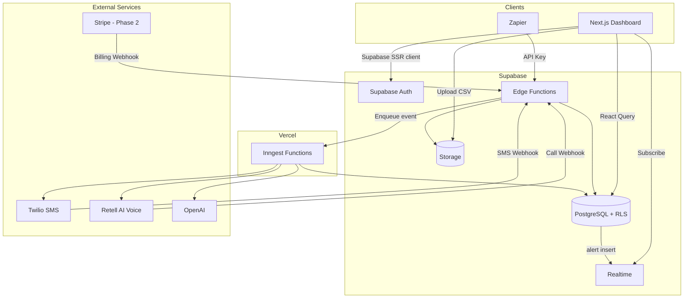
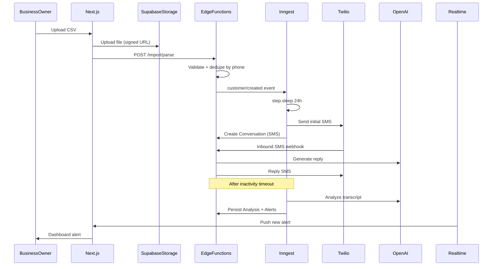
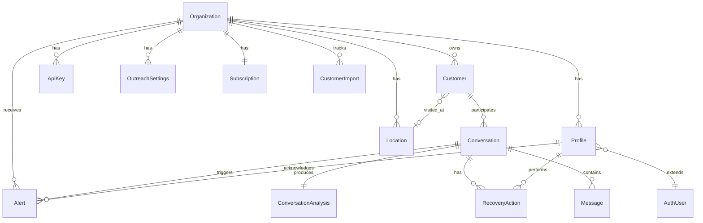
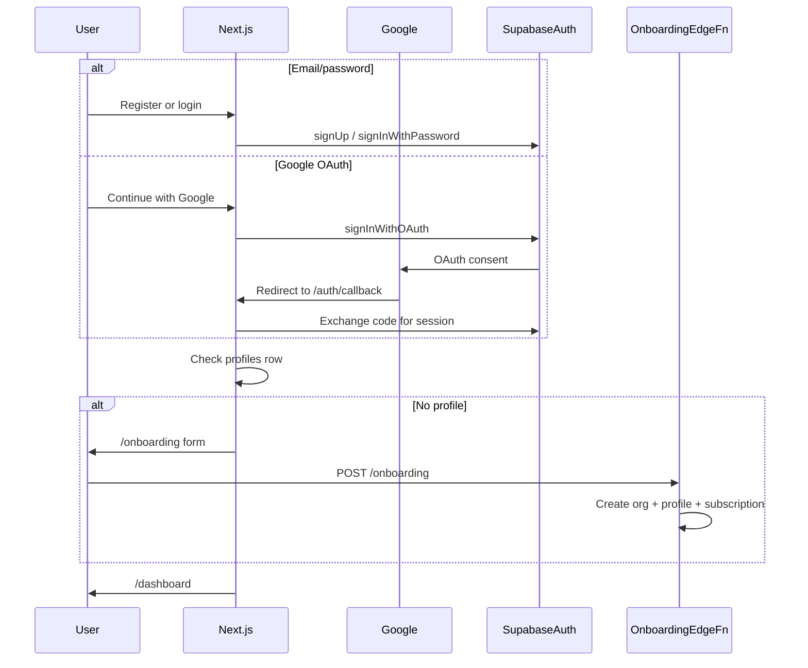
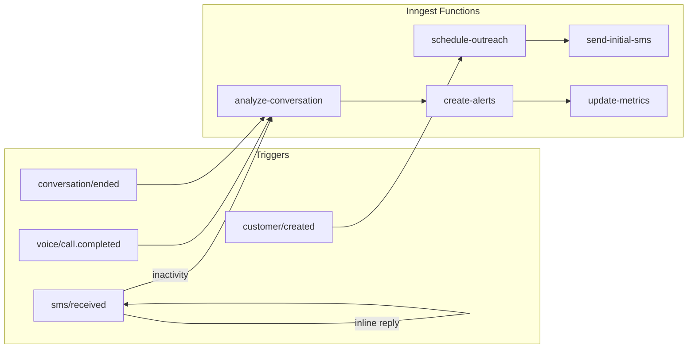
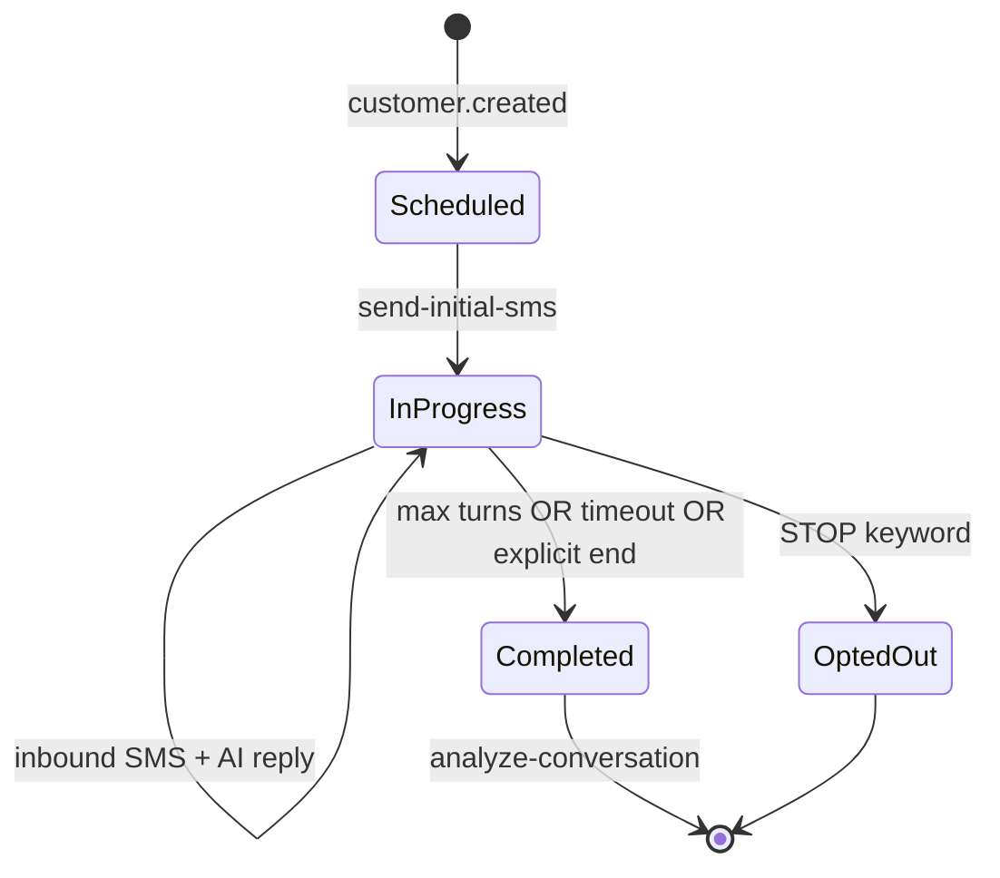
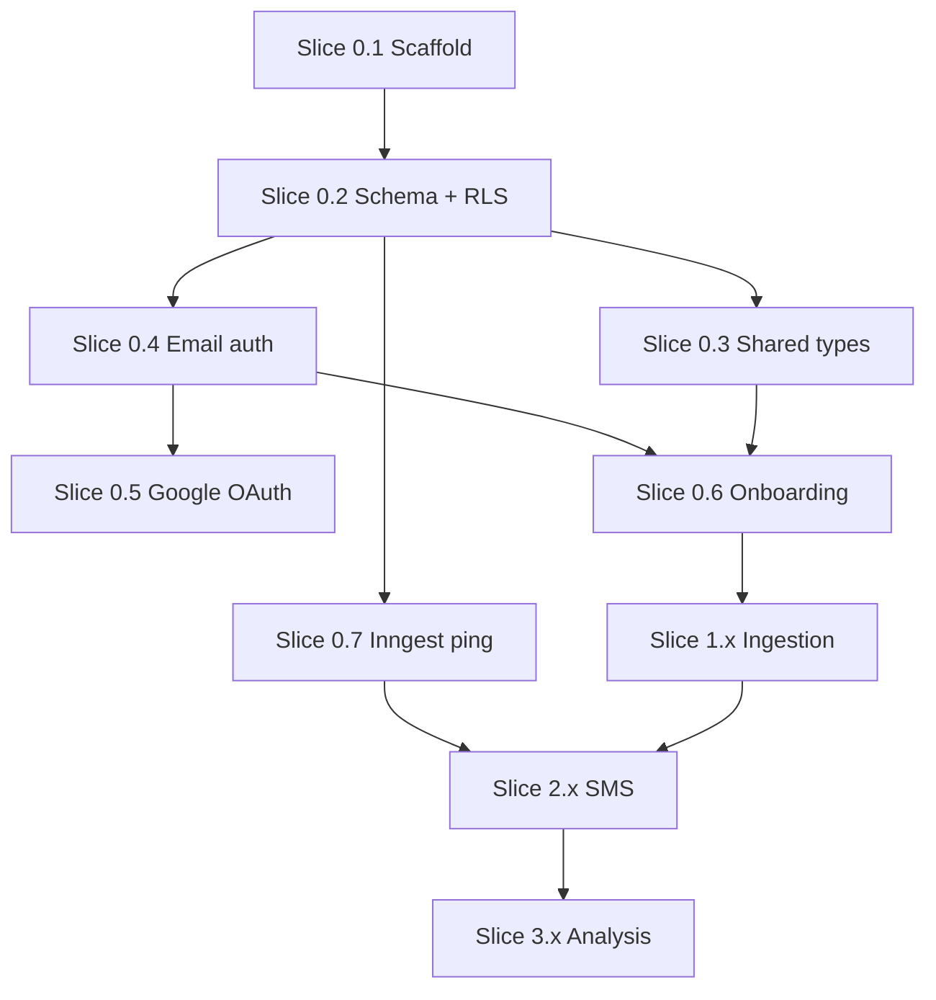

# Meduso AI — Technical Implementation Plan

## Executive Summary

Meduso AI is a **multi-tenant B2B SaaS** where each **Organization** (business) imports customers, schedules post-visit outreach (SMS default, voice optional), runs AI conversations, analyzes outcomes, and alerts owners to at-risk customers.

**MVP principle:** Supabase as the core platform (database, auth, storage, API, realtime), one job orchestrator (Inngest), and thin integration adapters (Twilio, Retell, OpenAI, Zapier). Avoid microservices, avoid premature CRM sync, ship the recovery loop end-to-end first.

**Recommended hosting (Supabase-first):**
- Frontend: [Vercel](https://vercel.com) — `apps/web` (Next.js App Router)
- Database: [Supabase PostgreSQL](https://supabase.com/database) — SQL migrations via Supabase CLI
- Auth: [Supabase Auth](https://supabase.com/auth) — email/password, **Google OAuth**, password reset, session management
- File storage: [Supabase Storage](https://supabase.com/storage) — CSV uploads
- API + webhooks: [Supabase Edge Functions](https://supabase.com/edge-functions) (Deno + Hono) — public API, Twilio/Retell/Stripe webhooks
- Realtime: [Supabase Realtime](https://supabase.com/realtime) — live alert updates on dashboard
- Background jobs: [Inngest](https://www.inngest.com) — delayed outreach (24h), analysis, retries (no Redis required)

**What Supabase does not replace (still required):**
- Twilio, Retell AI, OpenAI (external APIs)
- Inngest (or Upstash QStash) for reliable delayed/background work — Edge Functions alone cannot run a 24-hour delayed job queue
- Vercel for Next.js hosting

**NestJS is removed** in this variant. Business logic lives in Edge Functions + Inngest functions + Next.js server actions where appropriate.

---

## 0. Supabase Fit Analysis

| Capability | Supabase service | Notes |
|------------|------------------|-------|
| PostgreSQL + Prisma/SQL | Database | Drop-in; use Supabase connection pooler (`?pgbouncer=true`) for serverless |
| Multi-tenant isolation | RLS policies | Enforce `organizationId` at DB layer; service role for webhooks/API keys |
| Business auth | Supabase Auth | Email/password + Google OAuth; link `auth.users` → `profiles` → `organizations` |
| CSV uploads | Storage bucket `imports` | Private bucket; signed URLs for upload/download |
| Public REST API (Zapier) | Edge Functions | `functions/v1/customers` with API key middleware |
| Twilio/Retell webhooks | Edge Functions | Fast ack + Inngest for async processing |
| Live dashboard alerts | Realtime | Subscribe to `alerts` table inserts per org |
| 24h delayed SMS | Inngest `step.sleep` | Native delay support; replaces BullMQ |
| Subscription billing | Edge Function webhook | Stripe → `functions/v1/webhooks/stripe` |

**Trade-off vs NestJS:** Edge Functions are stateless (150s max execution on Pro). Long AI analysis and multi-step workflows belong in Inngest, not inline in webhooks. This is the right split for MVP.

---

## 1. High-Level Architecture



### Core architectural patterns

| Pattern | Choice | Rationale |
|---------|--------|-----------|
| Tenancy | `organizationId` + RLS policies | DB-enforced isolation; franchises/multi-location later |
| API style | REST via Edge Functions (Hono router) | Zapier-friendly; OpenAPI via Zod schemas |
| Async work | Inngest step functions | Native delays (`step.sleep('24h')`), retries, no Redis |
| Events | `inngest.send()` from Edge Functions / DB triggers | Sufficient for MVP; upgrade to Kafka later if needed |
| Auth | Supabase Auth + `profiles` table | Email/password + Google OAuth; `@supabase/ssr` in Next.js |
| File storage | Supabase Storage | CSV uploads; RLS on bucket paths per org |
| Realtime | Supabase Realtime on `alerts` | Instant alert badge updates without polling |
| Idempotency | `Idempotency-Key` header + `webhook_events` table | Critical for Zapier + webhook retries |
| DB access (server) | Service role key in Edge Functions/Inngest only | Never expose to browser; browser uses anon key + RLS |

### Request flow (happy path)



---

## 2. Database Schema

### Design principles
- **UUID primary keys** everywhere (safe for public APIs, Zapier)
- **Soft deletes** on `customers` only (compliance); hard delete elsewhere for MVP
- **JSONB** for provider payloads (Twilio, Retell) — audit/debug without schema churn
- **Enums** in Postgres via SQL migrations (`supabase/migrations/`)
- **RLS** enabled on all tenant tables; policies keyed on `profiles.organization_id`
- **Indexes** on `(organizationId, ...)`, `phoneE164`, `status`, `createdAt`

### Row Level Security (RLS) pattern

```sql
-- Helper: resolve current user's organization
CREATE OR REPLACE FUNCTION auth.organization_id() RETURNS UUID AS $$
  SELECT organization_id FROM profiles WHERE id = auth.uid()
$$ LANGUAGE sql STABLE SECURITY DEFINER;

-- Example policy on customers
ALTER TABLE customers ENABLE ROW LEVEL SECURITY;
CREATE POLICY customers_org_isolation ON customers
  FOR ALL USING (organization_id = auth.organization_id());
```

- **Browser client** uses anon key + user JWT → RLS enforces tenant boundary automatically
- **Edge Functions / Inngest** use service role → must manually validate `organizationId` from API key or JWT claims
- **Storage RLS:** bucket path `{organizationId}/{importId}.csv` with matching policy

### Entity Relationship Diagram



### Tables (Supabase SQL migrations)

#### `organizations`
| Column | Type | Notes |
|--------|------|-------|
| id | UUID PK | |
| name | TEXT | Business name |
| slug | TEXT UNIQUE | URL-safe |
| timezone | TEXT | Default `America/New_York` |
| industry | TEXT NULL | Future benchmarking |
| settings | JSONB | `{ defaultOutreachDelayHours: 24, smsEnabled: true, voiceEnabled: false }` |
| createdAt, updatedAt | TIMESTAMPTZ | |

#### `profiles` (extends `auth.users`)
| Column | Type | Notes |
|--------|------|-------|
| id | UUID PK FK → `auth.users.id` | Same ID as Supabase Auth user |
| organizationId | UUID FK | |
| role | ENUM | `OWNER`, `ADMIN`, `MEMBER` |
| name | TEXT | |
| createdAt, updatedAt | TIMESTAMPTZ | |

Password reset handled by Supabase Auth (`supabase.auth.resetPasswordForEmail`). No `passwordHash` column needed. OAuth users (Google) have no password; provider stored in `auth.identities`.

**Registration flow (unified for email + Google):**
1. User authenticates via email/password **or** Google OAuth
2. App checks whether a `profiles` row exists for `auth.uid()`
3. If missing → redirect to `/onboarding` (collect `businessName`, `timezone`; pre-fill `name` from Google profile metadata)
4. `POST /onboarding` Edge Function creates `organizations`, `profiles`, `subscriptions`, `outreach_settings` atomically
5. If profile exists → redirect to `/dashboard`

Do **not** auto-create org on `auth.users` insert — OAuth users must complete onboarding so we capture business name.

#### `subscriptions` (subscription-ready, Stripe wired Phase 2)
| Column | Type | Notes |
|--------|------|-------|
| id | UUID PK | |
| organizationId | UUID FK UNIQUE | |
| plan | ENUM | `FREE`, `STARTER`, `GROWTH`, `ENTERPRISE` |
| status | ENUM | `TRIALING`, `ACTIVE`, `PAST_DUE`, `CANCELED` |
| stripeCustomerId | TEXT NULL | |
| stripeSubscriptionId | TEXT NULL | |
| trialEndsAt | TIMESTAMPTZ NULL | |
| currentPeriodEnd | TIMESTAMPTZ NULL | |

#### `locations` (MVP: optional; schema now, UI later)
| Column | Type | Notes |
|--------|------|-------|
| id | UUID PK | |
| organizationId | UUID FK | |
| name | TEXT | e.g. "Downtown" |
| externalId | TEXT NULL | Zapier/CRM mapping |
| address | JSONB NULL | |
| isActive | BOOLEAN | |

#### `customers`
| Column | Type | Notes |
|--------|------|-------|
| id | UUID PK | |
| organizationId | UUID FK | |
| locationId | UUID FK NULL | |
| name | TEXT | |
| phoneE164 | TEXT | Normalized E.164 |
| email | TEXT NULL | |
| lastVisitDate | DATE NULL | |
| source | ENUM | `CSV`, `API`, `ZAPIER`, `MANUAL` |
| externalId | TEXT NULL | Idempotency for integrations |
| metadata | JSONB | Extra Zapier fields |
| deletedAt | TIMESTAMPTZ NULL | Soft delete |
| UNIQUE | (organizationId, phoneE164) | Dedupe rule |

#### `customer_imports`
| Column | Type | Notes |
|--------|------|-------|
| id | UUID PK | |
| organizationId | UUID FK | |
| fileName | TEXT NULL | |
| source | ENUM | `CSV`, `API`, `ZAPIER` |
| status | ENUM | `PROCESSING`, `COMPLETED`, `FAILED` |
| totalRows, successRows, failedRows | INT | |
| errorReport | JSONB NULL | Row-level errors |

#### `outreach_settings` (per-org defaults; overridable per customer later)
| Column | Type | Notes |
|--------|------|-------|
| organizationId | UUID PK/FK | |
| smsDelayHours | INT DEFAULT 24 | |
| smsTemplate | TEXT | "Hi {{name}}, thanks for visiting..." |
| voiceEnabled | BOOLEAN | |
| maxSmsTurns | INT DEFAULT 6 | Conversation length guard |
| quietHoursStart, quietHoursEnd | TIME NULL | Compliance |

#### `conversations`
| Column | Type | Notes |
|--------|------|-------|
| id | UUID PK | |
| organizationId | UUID FK | |
| customerId | UUID FK | |
| channel | ENUM | `SMS`, `VOICE` |
| status | ENUM | `SCHEDULED`, `IN_PROGRESS`, `COMPLETED`, `FAILED`, `OPTED_OUT` |
| scheduledAt | TIMESTAMPTZ NULL | |
| startedAt, endedAt | TIMESTAMPTZ NULL | |
| twilioConversationSid | TEXT NULL | If using Conversations API |
| retellCallId | TEXT NULL | |
| recordingUrl | TEXT NULL | Voice only |
| transcriptRaw | TEXT NULL | Full transcript cache |
| recoveryStatus | ENUM | `OPEN`, `IN_RECOVERY`, `RECOVERED`, `RESOLVED`, `LOST` |
| providerMetadata | JSONB | |

#### `messages`
| Column | Type | Notes |
|--------|------|-------|
| id | UUID PK | |
| conversationId | UUID FK | |
| role | ENUM | `SYSTEM`, `ASSISTANT`, `CUSTOMER` |
| content | TEXT | |
| channel | ENUM | `SMS`, `VOICE` |
| providerMessageId | TEXT NULL | Twilio SID |
| createdAt | TIMESTAMPTZ | |

#### `conversation_analyses`
| Column | Type | Notes |
|--------|------|-------|
| id | UUID PK | |
| conversationId | UUID FK UNIQUE | One analysis per conversation (re-run creates version later) |
| sentimentScore | DECIMAL(-1 to 1) | |
| satisfactionScore | INT(1-10) | |
| churnRisk | ENUM | `LOW`, `MEDIUM`, `HIGH` |
| complaintCategories | TEXT[] | e.g. `["wait_time","staff_attitude"]` |
| praiseCategories | TEXT[] | |
| summary | TEXT | |
| recommendedAction | TEXT | |
| model | TEXT | `gpt-4o-mini` etc. |
| rawResponse | JSONB | Audit |
| analyzedAt | TIMESTAMPTZ | |

#### `alerts`
| Column | Type | Notes |
|--------|------|-------|
| id | UUID PK | |
| organizationId | UUID FK | |
| conversationId | UUID FK | |
| customerId | UUID FK | |
| type | ENUM | `NEGATIVE_SENTIMENT`, `HIGH_CHURN_RISK`, `ESCALATION_REQUESTED` |
| severity | ENUM | `LOW`, `MEDIUM`, `HIGH`, `CRITICAL` |
| status | ENUM | `OPEN`, `ACKNOWLEDGED`, `RESOLVED` |
| summary | TEXT | |
| recommendedAction | TEXT | |
| acknowledgedByUserId | UUID FK NULL | |
| acknowledgedAt | TIMESTAMPTZ NULL | |

#### `recovery_actions`
| Column | Type | Notes |
|--------|------|-------|
| id | UUID PK | |
| conversationId | UUID FK | |
| userId | UUID FK | Who acted |
| action | ENUM | `NOTE`, `MARK_RECOVERED`, `MARK_RESOLVED`, `CONTACT_CUSTOMER` |
| note | TEXT NULL | |
| metadata | JSONB NULL | e.g. outbound SMS sid |
| createdAt | TIMESTAMPTZ | |

#### `api_keys`
| Column | Type | Notes |
|--------|------|-------|
| id | UUID PK | |
| organizationId | UUID FK | |
| name | TEXT | "Zapier Production" |
| keyPrefix | TEXT | First 8 chars for display |
| keyHash | TEXT | SHA-256 of full key |
| scopes | TEXT[] | `customers:write`, `customers:read` |
| lastUsedAt | TIMESTAMPTZ NULL | |
| revokedAt | TIMESTAMPTZ NULL | |

#### `webhook_events` (idempotency + audit)
| Column | Type | Notes |
|--------|------|-------|
| id | UUID PK | |
| provider | ENUM | `TWILIO`, `RETELL`, `STRIPE` |
| externalEventId | TEXT UNIQUE | |
| payload | JSONB | |
| processedAt | TIMESTAMPTZ NULL | |

#### `usage_counters` (billing guardrails)
| Column | Type | Notes |
|--------|------|-------|
| organizationId | UUID FK | |
| period | TEXT | `2026-06` |
| smsSent | INT | |
| voiceMinutes | INT | |
| customersImported | INT | |
| UNIQUE(organizationId, period) | | |

---

## 3. API Specification

Two API surfaces:

1. **Dashboard reads/writes** — Next.js uses Supabase client directly (RLS-protected) for most CRUD; React Query wraps `supabase.from('customers').select()`
2. **Edge Functions** — Public integrations, webhooks, and operations requiring service role

**Edge Function base URL:** `https://<project-ref>.supabase.co/functions/v1`  
**Auth (Edge Functions):** `Authorization: Bearer <supabase_jwt>` (dashboard) or `X-Api-Key: <key>` (Zapier)  
**Format:** JSON; errors follow RFC 7807 Problem Details  
**Pagination:** `?page=1&limit=25`; response includes `{ data, meta: { total, page, limit } }`

### Auth (Supabase Auth — client-side via `@supabase/ssr`)

| Method | SDK call | Description |
|--------|----------|-------------|
| Register (email) | `supabase.auth.signUp()` → `/onboarding` | Create auth user; org created after onboarding |
| Login (email) | `supabase.auth.signInWithPassword()` | Session cookie managed by SSR |
| Register/Login (Google) | `supabase.auth.signInWithOAuth({ provider: 'google' })` | Redirect to Google; same onboarding gate for new users |
| OAuth callback | `app/auth/callback/route.ts` | Exchange auth code for session; redirect to `/onboarding` or `/dashboard` |
| Logout | `supabase.auth.signOut()` | Clear session |
| Forgot password | `supabase.auth.resetPasswordForEmail()` | Email users only |
| Reset password | `supabase.auth.updateUser({ password })` | On `/reset-password` page; email users only |
| Current user | `supabase.auth.getUser()` + join `profiles` | User + org context |

**Google OAuth SDK call:**
```typescript
await supabase.auth.signInWithOAuth({
  provider: 'google',
  options: {
    redirectTo: `${origin}/auth/callback`,
    queryParams: { access_type: 'offline', prompt: 'consent' },
  },
});
```

**Google OAuth setup (one-time):**
1. Create OAuth 2.0 Client in [Google Cloud Console](https://console.cloud.google.com/apis/credentials)
2. Authorized redirect URI: `https://<project-ref>.supabase.co/auth/v1/callback`
3. Enable Google provider in Supabase Dashboard → Authentication → Providers; paste Client ID + Secret
4. Add app redirect URLs in Supabase → URL Configuration: `http://localhost:3000/auth/callback`, `https://app.meduso.ai/auth/callback`

**Auth middleware (Next.js):** Protected routes check session; if authenticated but no `profiles` row → force `/onboarding`.

**Onboarding Edge Function body (`POST /onboarding`):**
```json
{
  "businessName": "Acme Dental",
  "name": "Jane Doe",
  "timezone": "America/Chicago"
}
```
Called once after first auth (email or Google) to create `organizations`, `profiles`, `subscriptions`, `outreach_settings`. `name` optional when Google provides `user.user_metadata.full_name`.



### Customers

| Method | Endpoint | Description |
|--------|----------|-------------|
| GET | `/customers` | List (filter: locationId, search, date range) |
| POST | `/customers` | Create single customer |
| POST | `/customers/import` | CSV multipart upload |
| GET | `/customers/:id` | Detail + latest conversation |
| PATCH | `/customers/:id` | Update |
| DELETE | `/customers/:id` | Soft delete |

**Create customer (API/Zapier):**
```json
{
  "name": "John Smith",
  "phone": "+15551234567",
  "email": "john@example.com",
  "visitDate": "2026-06-08",
  "location": "Downtown",
  "externalId": "crm-12345"
}
```

Headers: `Idempotency-Key: <uuid>` (recommended for Zapier)

### Outreach

| Method | Endpoint | Description |
|--------|----------|-------------|
| GET | `/outreach/settings` | Org outreach config |
| PATCH | `/outreach/settings` | Update delay, templates |
| POST | `/outreach/sms/:customerId/trigger` | Manual SMS start (skip delay) |
| POST | `/outreach/voice/:customerId/trigger` | Initiate Retell call |

### Conversations

| Method | Endpoint | Description |
|--------|----------|-------------|
| GET | `/conversations` | List (filters: status, channel, recoveryStatus) |
| GET | `/conversations/:id` | Transcript + analysis + alerts |
| POST | `/conversations/:id/end` | Force end + enqueue analysis |
| PATCH | `/conversations/:id/recovery` | Update recovery status + notes |

**Recovery action body:**
```json
{
  "action": "MARK_RECOVERED",
  "note": "Offered 20% discount, customer accepted"
}
```

### Alerts

| Method | Endpoint | Description |
|--------|----------|-------------|
| GET | `/alerts` | List (filter: status, severity) |
| PATCH | `/alerts/:id` | Acknowledge / resolve |

### Analytics / Dashboard

| Method | Endpoint | Description |
|--------|----------|-------------|
| GET | `/analytics/overview` | KPI cards |
| GET | `/analytics/complaints` | Top categories + trends |
| GET | `/analytics/praise` | Top praise categories |
| GET | `/analytics/alerts/recent` | Last N alerts |

**Overview response shape:**
```json
{
  "customersContacted": 142,
  "conversationsCompleted": 98,
  "recoveryOpportunities": 17,
  "customersRecovered": 9,
  "revenueProtected": 4500
}
```

`revenueProtected` MVP formula: `recoveredCount * org.settings.avgCustomerValue` (configurable; honest labeling in UI).

### API Keys & Integrations

| Method | Endpoint | Description |
|--------|----------|-------------|
| POST | `/api-keys` | Create (returns full key once) |
| GET | `/api-keys` | List |
| DELETE | `/api-keys/:id` | Revoke |

### Webhooks (inbound, no auth — signature verified)

| Method | Endpoint | Description |
|--------|----------|-------------|
| POST | `/webhooks/twilio/sms` | Inbound SMS + status callbacks |
| POST | `/webhooks/retell` | Call started/ended/analyzed |
| POST | `/webhooks/stripe` | Phase 2 billing |

### Zapier integration (MVP)

Expose as **REST Hooks + polling triggers** via Zapier Platform (separate `integrations/zapier` package):

- **Trigger:** New Alert (REST hook on alert creation)
- **Trigger:** New Conversation Completed (REST hook)
- **Action:** Create Customer → `POST /customers`
- **Action:** Trigger Voice Call → `POST /outreach/voice/:customerId/trigger`

Authentication: API key in Zapier connection UI.

---

## 4. Event-Driven Workflow Design

### Domain events (Edge Functions / DB triggers → Inngest)

| Event | Producer | Inngest function |
|-------|----------|------------------|
| `customer/created` | Edge Function or DB trigger | `schedule-outreach` |
| `customer/imported` | Import Edge Function | `schedule-outreach` (per row) |
| `outreach/due` | `schedule-outreach` after `step.sleep` | `send-initial-sms` |
| `sms/received` | Twilio webhook Edge Function | Inline AI reply; `check-conversation-timeout` (scheduled) |
| `conversation/ended` | Timeout, manual, or max turns | `analyze-conversation` |
| `analysis/completed` | `analyze-conversation` | `create-alerts`, `update-metrics` |
| `voice/call.requested` | Outreach Edge Function | `initiate-retell-call` |
| `voice/call.completed` | Retell webhook | `analyze-conversation` |
| `alert/created` | `create-alerts` | `notify-owner` (email Phase 2) |



### SMS conversation state machine



**Timeout rule:** No customer message for **2 hours** after last assistant message → auto-complete and analyze.

**Opt-out:** Twilio STOP/HELP compliance; mark `OPTED_OUT`, never message again.

### Voice workflow (Retell AI)

1. `initiate-retell-call` Inngest function calls Retell outbound API with:
   - `agent_id` (per-org or global template)
   - `to_number`, `from_number` (Twilio number)
   - `metadata`: `{ conversationId, organizationId, customerId }`
2. Retell conducts call; webhooks stream transcript chunks (optional) or final transcript on `call_ended`
3. Persist `recordingUrl`, `transcriptRaw`, set status `COMPLETED`
4. Emit `conversation/ended` → `analyze-conversation`

---

## 5. Background Job Architecture (Inngest)

### Process model (Supabase + Vercel + Inngest)

| Component | Responsibility |
|-----------|----------------|
| Edge Functions | HTTP, webhooks, fast Twilio SMS replies, `inngest.send()` |
| Inngest (on Vercel) | Delayed outreach, analysis, voice initiation, retries |
| Supabase Postgres | Primary datastore (service role from Inngest) |
| Supabase Realtime | Push alert inserts to dashboard |

Inngest functions live in `apps/web/src/inngest/` and deploy with Vercel via the Inngest integration.

### Inngest functions (priority order)

1. **`schedule-outreach`** — `step.sleep(`${delayHours}h`)` then emit `outreach/due`
2. **`send-initial-sms`** — Twilio send, create conversation
3. **`check-conversation-timeout`** — Cron or delayed check after last message
4. **`analyze-conversation`** — OpenAI structured output (concurrency limit: 5)
5. **`create-alerts`** — Deterministic rules on analysis result
6. **`initiate-retell-call`** — Retell outbound API
7. **`notify-owner`** — Email (Phase 2)

### Job conventions

- **Retries:** Inngest built-in (3 attempts, exponential backoff)
- **Idempotency:** `id` field on `inngest.send({ id: 'customer-123-outreach' })` prevents duplicate scheduling
- **Delayed jobs:** `await step.sleep('24h')` in `schedule-outreach` — no Redis needed
- **Webhook dedup:** `webhook_events` table checked in Edge Functions before processing

### Key Inngest function signatures

```typescript
// Illustrative — not implementation code
scheduleOutreach({ customerId, organizationId, delayHours })
sendInitialSms({ conversationId })
analyzeConversation({ conversationId })
createAlerts({ analysisId, conversationId })
initiateRetellCall({ customerId, organizationId })
```

### Example: schedule-outreach flow

```typescript
// Illustrative — not implementation code
inngest.createFunction(
  { id: 'schedule-outreach' },
  { event: 'customer/created' },
  async ({ event, step }) => {
    await step.sleep('delay', `${event.data.delayHours}h`);
    await step.sendEvent('outreach-due', { name: 'outreach/due', data: event.data });
  }
);
```

---

## 6. AI Analysis Design

### Model strategy (MVP)

- **SMS replies:** `gpt-4o-mini` — low latency, low cost (~$0.15/1M input)
- **Post-conversation analysis:** `gpt-4o` or `gpt-4o-mini` with **structured outputs** (JSON schema)

### Analysis prompt outputs (strict JSON schema)

```json
{
  "sentimentScore": -0.72,
  "satisfactionScore": 3,
  "churnRisk": "HIGH",
  "complaintCategories": ["wait_time", "billing"],
  "praiseCategories": ["cleanliness"],
  "summary": "Customer frustrated by 45-min wait...",
  "recommendedAction": "Call within 24h, offer apology + priority booking",
  "escalationRequested": false
}
```

### Category taxonomy (controlled vocabulary)

Maintain `config/feedback-categories.json` — ~20 complaint + ~10 praise categories aligned to local business (dental, salon, restaurant). Model must pick from list; allow `other` with free-text subcategory stored in `rawResponse`.

### Alert rules (deterministic, post-LLM)

| Condition | Alert Type | Severity |
|-----------|------------|----------|
| `sentimentScore < -0.3` | NEGATIVE_SENTIMENT | MEDIUM if > -0.6 else HIGH |
| `churnRisk === HIGH` | HIGH_CHURN_RISK | HIGH |
| `escalationRequested === true` | ESCALATION_REQUESTED | CRITICAL |
| `satisfactionScore <= 4` | NEGATIVE_SENTIMENT | MEDIUM |

---

## 7. Security Considerations

### Authentication & authorization
- Supabase Auth handles email/password, **Google OAuth**, sessions, and password reset emails
- Google OAuth scoped to `email profile openid`; no access to Google APIs beyond identity
- **Account linking:** If a user signs up with email then later uses Google with the same email, enable "Automatic linking" in Supabase Auth settings (or handle manually in onboarding)
- OAuth users cannot use "Forgot password" — UI hides that option when `user.app_metadata.provider === 'google'`
- RBAC via `profiles.role`: `OWNER` > `ADMIN` > `MEMBER`
- **RLS policies** on all tenant tables — browser uses anon key; policies resolve org from `auth.uid()`
- Edge Functions + Inngest use **service role key** (server-only); validate `organizationId` from API key or JWT before writes
- API keys: show once, store SHA-256 hash, scope-limited; validated in Edge Function middleware

### Webhook security
- Twilio: validate `X-Twilio-Signature`
- Retell: verify HMAC signature header
- Stripe: verify webhook signing secret (Phase 2)
- Return 200 quickly; process in `webhooks` queue

### Data protection
- Supabase encrypts data at rest; enable Point-in-Time Recovery on Pro plan
- TLS everywhere
- Log redaction: never log full phone, tokens, transcripts in Edge Function logs
- CSV uploads: private Storage bucket; max 10MB; parse in Inngest function or Edge Function
- **Never expose `SUPABASE_SERVICE_ROLE_KEY` to the browser**

### Compliance (MVP baseline)
- TCPA: configurable outreach delay; quiet hours; opt-out handling; terms acknowledgment at registration
- GDPR-ready: export/delete customer endpoint (Phase 2 if EU customers)
- Rate limits: 100 req/min per API key; 10 imports/hour per org

### Secrets management
- Supabase project secrets for Edge Functions (`supabase secrets set`)
- Vercel env vars for Next.js + Inngest
- Separate Supabase projects for staging and production
- Never commit `.env.local`

---

## 8. Frontend Architecture (Next.js)

### Stack
- Next.js 15 App Router
- TypeScript, Tailwind, shadcn/ui
- TanStack Query (React Query) for server state
- React Hook Form + Zod validation
- Charts: Recharts

### Key pages

| Route | Purpose |
|-------|---------|
| `/login`, `/register`, `/forgot-password` | Auth (email + "Continue with Google" on login/register) |
| `/auth/callback` | OAuth code exchange (Google) |
| `/onboarding` | Post-auth business setup (required for all new users) |
| `/dashboard` | KPI overview + recent alerts |
| `/customers` | List, import CSV, add manual |
| `/customers/[id]` | Profile + conversation history |
| `/conversations` | All conversations |
| `/conversations/[id]` | Transcript, analysis, recovery actions |
| `/alerts` | Alert inbox |
| `/analytics` | Complaint/praise trends |
| `/settings` | Outreach, API keys, team (Phase 2), billing (Phase 2) |

### Data fetching pattern
- **Reads:** Supabase client + React Query — `supabase.from('customers').select()` (RLS auto-filters by org)
- **Writes:** Supabase client for simple updates; Edge Functions for import, outreach triggers, webhooks
- **Realtime:** `supabase.channel('alerts').on('postgres_changes', ...)` for live alert badge
- React Query keys: `['customers', orgId, filters]`
- Optimistic updates on recovery actions

---

## 9. Project Structure

```
meduso-ai/
├── apps/
│   └── web/                              # Next.js frontend + Inngest
│       ├── app/
│       │   ├── (auth)/                   # login, register, reset-password, onboarding
│       │   ├── auth/callback/route.ts    # Google OAuth callback
│       │   ├── (dashboard)/              # protected routes
│       │   ├── api/inngest/route.ts      # Inngest serve endpoint
│       │   └── layout.tsx
│       ├── src/
│       │   ├── inngest/
│       │   │   ├── client.ts
│       │   │   ├── functions/
│       │   │   │   ├── schedule-outreach.ts
│       │   │   │   ├── send-initial-sms.ts
│       │   │   │   ├── analyze-conversation.ts
│       │   │   │   └── create-alerts.ts
│       │   │   └── integrations/         # twilio, retell, openai
│       │   ├── components/
│       │   └── lib/
│       │       ├── supabase/
│       │       │   ├── client.ts         # browser client
│       │       │   ├── server.ts         # SSR client
│       │       │   └── middleware.ts
│       │       └── query-keys.ts
│       └── package.json
│
├── supabase/
│   ├── config.toml
│   ├── migrations/                       # SQL schema + RLS policies
│   ├── seed.sql
│   └── functions/
│       ├── _shared/                      # Hono middleware, supabase admin client
│       ├── onboarding/index.ts           # POST /onboarding
│       ├── customers/index.ts            # Public API (Zapier)
│       ├── import/index.ts               # CSV parse trigger
│       ├── outreach/index.ts             # Manual SMS/voice triggers
│       ├── webhooks-twilio/index.ts
│       ├── webhooks-retell/index.ts
│       └── webhooks-stripe/index.ts      # Phase 2
│
├── packages/
│   └── shared/                           # Types, enums, Zod schemas, categories
│
├── integrations/
│   └── zapier/
│
├── package.json
└── README.md
```

**Local dev:** `supabase start` (Postgres, Auth, Storage, Edge Functions locally) + `npx inngest-cli dev` + `npm run dev` in `apps/web`.

---

## 10. User Flows

### Flow A: Business onboarding
1. **Email path:** Register with email/password **OR Google path:** click "Continue with Google" on login/register
2. OAuth users return via `/auth/callback`; all new users without a `profiles` row go to `/onboarding`
3. Complete onboarding → create Organization + Profile + Subscription (`TRIALING`)
4. Land on dashboard → empty state prompts CSV upload or API key
5. Configure outreach delay + SMS template in Settings
6. Connect Zapier (copy API key)

### Flow B: CSV import → SMS recovery
1. Upload CSV → `customer_imports` row → async parse
2. Valid rows create `customers` → emit `customer.created`
3. After 24h → SMS sent → conversation `IN_PROGRESS`
4. Customer replies → AI converses (max 6 turns)
5. Timeout → analysis → alert if unhappy
6. Owner views alert → opens conversation → marks recovered + note

### Flow C: Voice call (manual)
1. Owner opens customer detail → "Start AI Call"
2. Retell places call → live status shown (polling or webhook-driven UI)
3. Call ends → transcript + recording on conversation page
4. Analysis + alerts same as SMS path

### Flow D: Zapier automation
1. Business connects POS/CRM Zap → "New appointment" trigger
2. Zap action: Create Customer in Meduso
3. Meduso schedules outreach automatically
4. Optional Zap: New Alert → Slack/email (via Zapier)

---

## 11. Phased Development Roadmap (30–45 days)

### Phase 0 — Foundation (Days 1–5)
- Monorepo scaffold (`apps/web`, `supabase/`, `packages/shared`)
- `supabase init` + SQL migrations (schema + RLS policies)
- Supabase Auth + Google OAuth provider + Next.js SSR (`@supabase/ssr`)
- `/auth/callback` route + `/onboarding` gate middleware
- Edge Functions shell (Hono router + shared middleware)
- Inngest client + serve route on Vercel
- CI: lint + typecheck on PR

**Exit criteria:** Email register/login and Google OAuth work end-to-end including onboarding gate; Supabase + Vercel + Inngest dev loop running.

### Phase 1 — Customer ingestion (Days 6–10)
- Customer CRUD via Supabase client (RLS)
- CSV upload to Storage + `import` Edge Function
- API key auth middleware in Edge Functions
- Public `POST /customers` Edge Function for Zapier
- Customers list UI + import UI

**Exit criteria:** 100-row CSV imports; dedupe by phone works.

### Phase 2 — SMS outreach loop (Days 11–18)
- Twilio provisioning (per-org subaccount optional later; start with one number + metadata routing)
- Inngest `schedule-outreach` + `send-initial-sms`
- Twilio webhook Edge Function + inline AI reply
- Conversation + message persistence
- Conversation detail UI

**Exit criteria:** End-to-end SMS conversation in staging with real phone.

### Phase 3 — AI analysis + alerts (Days 19–24)
- Inngest `analyze-conversation` + `create-alerts` with structured OpenAI output
- Supabase Realtime subscription for live alerts
- Alerts inbox UI
- Dashboard KPI queries (SQL aggregates via Supabase RPC or views)

**Exit criteria:** Negative test conversation generates alert with recommended action.

### Phase 4 — Voice + recovery workflow (Days 25–30)
- Retell integration (outbound call + webhooks)
- Recording URL storage
- Recovery actions API + UI
- Analytics pages (complaints, trends)

**Exit criteria:** Owner can call, review transcript, mark recovered.

### Phase 5 — Polish + launch prep (Days 31–38)
- Supabase Auth email templates (password reset)
- Zapier integration published (private beta)
- Rate limiting, error monitoring (Sentry)
- Onboarding empty states, loading skeletons
- Staging → production cutover

**Exit criteria:** 3 pilot businesses onboarded.

### Phase 6 — Subscription billing (Days 39–45, parallel-safe)
- Stripe Checkout + Customer Portal
- Plan limits via `usage_counters` (SMS/month caps)
- Webhook handlers for subscription lifecycle
- Upgrade prompts in UI

**Exit criteria:** Paid subscription blocks over-limit usage gracefully.

---

## 12. Suggested Implementation Order

Build vertically in this sequence — each step is demoable:

1. **SQL migrations + RLS policies** — data model is the contract
2. **Supabase Auth (email + Google) + onboarding flow** — everything else needs tenancy
3. **Customer CRUD + CSV import** — Storage + Edge Function
4. **API keys + public customer Edge Function** — unblocks Zapier early
5. **Inngest setup** — client, serve route, first test function
6. **Outreach settings + `schedule-outreach`**
7. **Twilio send + inbound webhook Edge Function**
8. **OpenAI SMS reply (inline in webhook)**
9. **Conversation timeout + end**
10. **`analyze-conversation` + `create-alerts`**
11. **Dashboard + Realtime alerts + conversations UI**
12. **Retell voice integration**
13. **Analytics (SQL views/RPC)**
14. **Recovery workflow UI**
15. **Zapier app**
16. **Stripe billing webhook**

---

## 13. Future-Proofing (post-MVP, schema already supports)

| Future feature | How architecture accommodates |
|----------------|-------------------------------|
| Multi-location | `locations` table; filter all queries by `locationId` |
| Franchises | `Organization.parentOrganizationId` (add later) |
| Multiple channels | `conversations.channel` enum + adapter interface |
| Review generation | New job after `RECOVERED` + Google API module |
| Industry benchmarking | Anonymized aggregate table by `industry` |
| CRM integrations | `externalId` + webhook outbound events |

### Integration adapter interface (shared package)

```typescript
// Pattern: IChannelAdapter { send(), handleInbound(), initiateCall() }
// Implementations: twilio.ts, retell.ts in packages/shared or src/inngest/integrations
// Used by Edge Functions (inbound) and Inngest functions (outbound)
```

---

## 14. Environment Variables (checklist)

**Supabase (auto-provided + secrets):** `SUPABASE_URL`, `SUPABASE_ANON_KEY`, `SUPABASE_SERVICE_ROLE_KEY`, `DATABASE_URL`

**Edge Function secrets:** `TWILIO_ACCOUNT_SID`, `TWILIO_AUTH_TOKEN`, `TWILIO_PHONE_NUMBER`, `RETELL_API_KEY`, `RETELL_AGENT_ID`, `OPENAI_API_KEY`, `INNGEST_EVENT_KEY`, `STRIPE_*` (Phase 2)

**Vercel (apps/web):** `NEXT_PUBLIC_SUPABASE_URL`, `NEXT_PUBLIC_SUPABASE_ANON_KEY`, `SUPABASE_SERVICE_ROLE_KEY`, `INNGEST_SIGNING_KEY`, `INNGEST_EVENT_KEY`, integration keys (same as above for Inngest functions)

---

## 15. Risks & Mitigations

| Risk | Mitigation |
|------|------------|
| Twilio deliverability | Register 10DLC brand/campaign early (Week 1) |
| AI reply quality | System prompt with business name, visit context, max 160 chars/SMS |
| OpenAI latency | Stream replies optional; cap conversation turns |
| Zapier duplicate customers | `externalId` + `Idempotency-Key` |
| Scope creep | Voice is Phase 4; billing Phase 6; no CRM sync in MVP |
| Edge Function cold starts | Keep webhook handlers lean; defer heavy work to Inngest |
| Inngest vendor dependency | Acceptable for MVP; fallback path is Upstash QStash |
| Supabase connection limits | Use pooler (`:6543`) from Inngest; direct connection for migrations only |

---

## 16. Multi-Agent Execution Strategy

### Guiding rules

1. **One slice = one PR = one agent session** — small enough to review in 15 minutes
2. **Never parallelize migrations** — schema is the contract; one agent owns it per slice
3. **Review gate after every slice** — Bugbot on diff, then merge before next slice starts
4. **Vertical slices over horizontal layers** — prefer "auth works end-to-end" over "all UI done"
5. **Stub integrations early** — Twilio/OpenAI adapters with mock mode unblock UI agents

### Where to start (do this first)

**Start with Slice 0.1 only.** Do not spin up parallel agents until 0.1 and 0.2 are merged.

| Order | Slice | Agent count | Why first |
|-------|-------|-------------|-----------|
| **1** | **0.1 Monorepo scaffold** | 1 | Empty repo; establishes folder conventions all agents follow |
| **2** | **0.2 SQL migrations + RLS** | 1 | Every other slice depends on tables and policies |
| 3 | 0.3 Shared types | 1 | Prevents type drift between web, Edge Functions, Inngest |
| 4 | 0.4 + 0.7 in parallel | 2 | Email auth and Inngest setup have no file conflicts |
| 5 | 0.6 Onboarding | 1 | Needs schema + auth; unblocks all dashboard work |
| 6 | 0.5 Google OAuth | 1 | Builds on 0.4 callback patterns; can ship after email auth |



### Review gate checklist (run after every slice)

- [ ] `npm run lint` and `npm run typecheck` pass
- [ ] `supabase db reset` applies migrations cleanly (after 0.2+)
- [ ] Bugbot review on PR diff — fix blockers before merge
- [ ] Security review on RLS/auth slices (0.2, 0.4, 0.5, 0.6, 1.3 API keys)
- [ ] Manual smoke test documented in PR description

---

### Sprint 0 — Foundation slices (detail)

#### Slice 0.1 — Monorepo scaffold
- **Agent:** 1 (general-purpose)
- **Scope:** Root `package.json`, `apps/web` Next.js 15 + Tailwind + shadcn init, `supabase/config.toml`, `packages/shared` empty export, GitHub Actions lint/typecheck, `.env.example`
- **Must NOT include:** Auth logic, migrations, Edge Functions
- **Done when:** `npm install && npm run dev` starts Next.js; CI green

#### Slice 0.2 — SQL migrations + RLS
- **Agent:** 1 (general-purpose)
- **Scope:** `supabase/migrations/00001_initial_schema.sql` — all tables from Section 2, enums, indexes, RLS helper `auth.organization_id()`, policies on every tenant table
- **Review:** Security review subagent (RLS bypass risks, service role usage)
- **Done when:** `supabase db reset` succeeds; can insert org + profile via SQL

#### Slice 0.3 — Shared types
- **Agent:** 1
- **Depends on:** 0.2
- **Scope:** `packages/shared` — enums (`ChurnRisk`, `AlertSeverity`, etc.), Zod DTOs, `feedback-categories.json`
- **Done when:** Imported by `apps/web` without circular deps

#### Slice 0.4 — Email auth + SSR middleware
- **Agent:** 1
- **Depends on:** 0.2
- **Scope:** `@supabase/ssr` clients, middleware session refresh, `/login`, `/register`, `/forgot-password` pages (UI only, no onboarding yet)
- **Done when:** Email register/login creates `auth.users` row; session persists

#### Slice 0.5 — Google OAuth
- **Agent:** 1
- **Depends on:** 0.4
- **Scope:** "Continue with Google" buttons, `/auth/callback/route.ts`, Supabase provider config docs in README
- **Done when:** Google login creates session; redirects correctly

#### Slice 0.6 — Onboarding
- **Agent:** 1
- **Depends on:** 0.2, 0.3, 0.4
- **Scope:** `supabase/functions/onboarding`, `/onboarding` page, middleware gate (no profile → onboarding), dashboard shell
- **Review:** Security review (service role in Edge Function, org creation atomicity)
- **Done when:** New user completes onboarding → lands on empty dashboard with org context

#### Slice 0.7 — Inngest setup
- **Agent:** 1 (can run parallel with 0.4)
- **Depends on:** 0.1
- **Scope:** `inngest` client, `app/api/inngest/route.ts`, `ping` function, dev instructions
- **Done when:** Inngest dev server shows `ping` function; event runs successfully

---

### Sprint 1 — Customer ingestion slices

| Slice | Scope | Agent | Depends on |
|-------|-------|-------|------------|
| 1.1 | Customer list + detail UI (read via Supabase client) | 1 | 0.6 |
| 1.2 | Customer create/edit/delete (RLS writes) | 1 | 1.1 |
| 1.3 | API keys table UI + `api_keys` CRUD + hash middleware | 1 | 0.6 |
| 1.4 | `customers` Edge Function (public POST, API key auth) | 1 | 1.3 |
| 1.5 | CSV Storage upload + `import` Edge Function + Inngest parse job | 1 | 1.2, 0.7 |

**Parallel opportunity:** 1.1 and 1.3 can run in parallel after 0.6 merges.

---

### Sprint 2 — SMS outreach slices

| Slice | Scope | Agent | Depends on |
|-------|-------|-------|------------|
| 2.1 | Twilio adapter in `packages/shared` + env docs | 1 | 0.3 |
| 2.2 | `schedule-outreach` + `send-initial-sms` Inngest functions | 1 | 1.5, 2.1 |
| 2.3 | `webhooks-twilio` Edge Function (inbound SMS + inline OpenAI reply) | 1 | 2.2 |
| 2.4 | Conversation + message persistence + timeout Inngest function | 1 | 2.3 |
| 2.5 | Conversation list + detail UI | 1 | 2.4 |

**Note:** Register Twilio 10DLC in parallel with Sprint 1 (human task, not agent).

---

### Sprint 3 — Analysis + alerts slices

| Slice | Scope | Agent | Depends on |
|-------|-------|-------|------------|
| 3.1 | OpenAI analysis adapter + structured output schema | 1 | 0.3 |
| 3.2 | `analyze-conversation` + `create-alerts` Inngest functions | 1 | 2.4, 3.1 |
| 3.3 | Alerts inbox UI + Supabase Realtime subscription | 1 | 3.2 |
| 3.4 | Dashboard KPI SQL views/RPC + overview UI | 1 | 3.2 |

**Parallel opportunity:** 3.3 and 3.4 after 3.2 merges.

---

### Sprint 4–6 — Voice, launch, billing

Follow same pattern: one integration per slice, UI slice separate, review between each.

| Sprint | Slices | Parallel? |
|--------|--------|-----------|
| 4 | 4.1 Retell adapter → 4.2 voice Inngest + webhook → 4.3 recovery UI → 4.4 analytics UI | 4.3 + 4.4 parallel after 4.2 |
| 5 | 5.1 Sentry + rate limits → 5.2 Zapier app → 5.3 polish/empty states | 5.1 first |
| 6 | 6.1 Stripe webhook → 6.2 usage counters → 6.3 billing UI | Sequential |

---

### Agent assignment cheat sheet

| Task type | Subagent | When |
|-----------|----------|------|
| Scaffold, feature slices | `generalPurpose` | Default for all slices |
| RLS, auth, API keys | `security-review` | After 0.2, 0.6, 1.3, 1.4 |
| PR diff review | Bugbot (`review-bugbot` skill) | Every slice before merge |
| Explore existing patterns | `explore` | Start of each sprint only |
| CI failures | `ci-investigator` | When checks break |

### Human tasks (not agent work)

- Create Supabase project (staging + prod)
- Create Vercel project + env vars
- Google Cloud OAuth client + Supabase provider toggle
- Twilio account + 10DLC registration (**start Week 1**)
- Retell agent setup (Sprint 4)
- Inngest account + Vercel integration

---

## Summary

This plan delivers a **Supabase-first, multi-tenant SaaS** with RLS-enforced isolation, Edge Functions for integrations, Inngest for reliable delayed workflows, and a Postgres schema that supports multi-location and billing without migration pain. The **SMS-first outreach loop** remains the critical path to paying customers in 30–45 days. Voice, Zapier, and Stripe layer on once the core **import → converse → analyze → alert → recover** cycle is proven.
